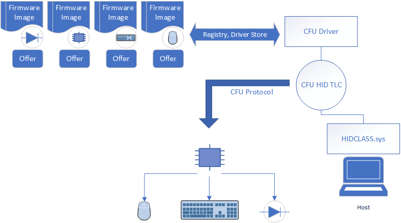

# Component Firmware Update Driver

The Microsoft Devices team has announced the release of an open-source model to update the firmware of peripheral devices– Component Firmware Update (CFU). The solution allows seamless and secure firmware update for components connected through interconnect buses such as USB, Bluetooth, I<sup>2</sup>C, etc. As part of the open-source effort, we are sharing a CFU protocol specification, sample CFU driver, and firmware sample code to allow device manufacturers to push firmware updates over Windows Update.

- The sample CFU driver is a UMDF driver that talks to the device using the HID protocol. As a firmware developer, you can customize the driver for the purposes of adopting the CFU model to enable firmware updates for your component(s). Source: [CFU Driver](../CFU/Host).
- CFU protocol specification describes a generic HID protocol to update firmware for components present on a PC or accessories. The specification allows for a component to accept firmware without interrupting the device operation during a download. Specification: [Component Firmware Update Protocol Specification](../CFU/Documentation/Specification)
- The sample firmware code… Source: [CFU Firmware](../CFU/Host).

- [Component Firmware Update Driver](#component-firmware-update-driver)
    - [Before you begin ...](#before-you-begin)
    - [Overview](#overview)
    - [Customize the CFU driver sample](#customize-the-cfu-driver-sample)
        - [1. Choose a deployment approach](#1-choose-a-deployment-approach)
            - [The multiple packages approach (Recommended)](#the-multiple-packages-approach-recommended)
            - [The monolithic package approach](#the-monolithic-package-approach)
        - [2. Configure the CFU driver INF](#2-configure-the-cfu-driver-inf)
        - [3. Provide WPP trace GUID](#3-provide-wpp-trace-guid)
        - [4. Deploy the package through Windows Update](#4-deploy-the-package-through-windows-update)
    - [Firmware File Format](#firmware-file-format)
        - [Offer format](#offer-format)
        - [Payload format](#payload-format)
        - [Configure device capabilities in the registry](#configure-device-capabilities-in-the-registry)
        - [Firmware update status provided by the driver](#firmware-update-status-provided-by-the-driver)
    - [Troubleshooting Tips](#troubleshooting-tips)
    - [FAQ](#faq)
    - [Appendix](#appendix)

## Before you begin ... 

Familiarize yourself with the CFU protocol.

- [Blog: Introducing Component Firmware Update](https://blogs.windows.com/buildingapps/2018/08/15/introducing-driver-module-framework/)
- [Component Firmware Update Protocol Specification]()
- [Github Resources](https://github.com/Microsoft/CFU/tree/)

## Overview

To update the firmware image for your device by using the CFU model, you are expected,

- To provide a CFU driver. This driver sends the firmware update to the device. We recommend that you customize the sample CFU driver to support your firmware update scenarios.
- Your device must ship with a firmware image that is compliant with the CFU protocol so that it can accept an update from the CFU driver.
- The device must expose itself as HID device to the operating system (running the CFU driver) and expose a HID Top-Level Collection (TLC). The CFU driver loads on the TLC and sends the firmware update to the device. 

This allows you to service your in-market devices through Windows Update. To update the firmware for a component, you deploy the CFU driver through the Windows update, and the driver gets installed on a Windows host. When the driver detects the presence of a component, it performs the necessary actions on the host and transmits the firmware image to the primary component on the device.



## Customize the CFU driver sample

Customize the CFU driver sample to meet your needs. To do so, choose a deployment package approach, modify the INF file, change the name of the driver binary, and update some logging GUIDs.

### 1. Choose a deployment approach

There are two deployment approaches to packaging the driver and the firmware for: multiple packages or monolithic package.

#### The multiple packages approach (Recommended)

Starting in Windows 10, version 1709, an INF functionality can be split into different packages. Using that functionality, split the deployment package into one base package and several extension packages. The base package contains the driver binary and the driver INF that is common for all your devices. The extension package contains the firmware image files and an INF that describes those firmware files for a device. 
Base package and extensions packages are serviced independently.

**When to use this approach**

**Challenges**

- This option is only available in Windows 10, version 1709 and later.

**To create multiple packages:**

1. Define a base package that contains the common driver binary and an INF that describes the hardware IDs for each device that is going to use the CFU driver. 
2. Define a separate extension package for each device, which contains:
    - The firmware image file(s) for the device.
    - An extension INF that describes the hardware ID for the specific device. The INF also specifies the path of the firmware files.

**Example**

- Base Package for Contoso CFU driver
  - ContosoCFU.inf
  - ContosoCFU.dll

- Extension Package for Contoso Keyboard
  - ContosoCFUKeyboardXYZ.inf
  - ContoseCFUKeyboardOffer.bin
  - ContosoCFUKeyboardPayload.bin

- Extension Package for Contoso Mouse
  - ContosoCFUMouseXYZ.inf
  - ContosoCFUMouseXYZ.dll
  - ContoseCFUMouseOffer.bin

Reference sample: <<link>>

****

#### The monolithic package approach

In this approach, there is one driver package per CFU capable device. The package includes: INF, the CFU driver binary, and firmware files for the device.

**When to use this approach**

- If your company ships only a handful of devices. Typically, a 1:1 mapping exists between the driver package and the device to which the driver is offering the updated firmware.
- To support updates for your devices on version of Windows earlier than Windows 10, version 1709.

**Challenges**

- If you ship multiple devices, you must change the name of the driver binary for each device.  
- If you ship multiple components, you must duplicate and maintain multiple copies of the driver binary which is identical for all devices supporting CFU.
- Because one INF is used for multiple devices, the driver and firmware file(s) for multiple devices are bundled in one package. This approach can unnecessarily bloat the package.

**Example**

- Monolithic Package for Contoso Keyboard
  - ContosoCFUKeyboardXYZ.inf
  - ContoseCFUKeyboardOffer.bin
  - ContosoCFUKeyboardPayload.bin

- Monolithic Package for Contoso Mouse
  - ContosoCFUMouseXYZ.inf
  - ContosoCFUMouseXYZ.dll
  - ContoseCFUMouseOffer.bin 


Reference sample: <<link>>

### 2. Configure the CFU driver INF
The sample CFU driver is extensible. To tune the driver’s behavior, change the driver INF instead of the source code.

1. Update the INF with the hardware ID of the HID TLC intended for firmware update.
Windows ensures that the driver is loaded when the component is enumerated on the host.
2. Update the INF with hardware IDs of your devices.

   **The multiple packages approach**

   1. Start with the ComponentFirmwareUpdate.inx as the base package INF. Replace the hardware ID in in this section with hardwareID(s) of all your supported devices.
        ```
        ; Target the Hardware ID for your devices.
        ;
        [Standard.NT$ARCH$]
        %ComponentFirmwareUpdate.DeviceDesc%=ComponentFirmwareUpdate, HID\HID\VID_abc&UP:def_U:ghi ; Your HardwareID- Laptop MCU
    
        %ComponentFirmwareUpdate.DeviceDesc%=ComponentFirmwareUpdate, HID\HID\VID_jkl&UP:mno_U:pqr ; Your HardwareID- Dock MCU
        ```
    2. Start with the DockFirmwareUpdate.inx as the extension package INF. Provide the hardware ID for each of your component in the device in this section. 
        ```
        [Standard.NT$ARCH$]
        %DockFirmwareUpdate.ExtensionDesc%=DockFirmwareUpdate, HID\....; Your HardwareID for Dock MCU
        ```
    3. Add a new extension package for each component.

    **The multiple packages approach**

    1. Start with LaptopFirmwareUpdate.inx here. Replace the hardware ID in in this section with hardwareID(s) of all your supported devices.
        ```
        [Standard.NT$ARCH$]
        %LaptopFirmwareUpdate.DeviceDesc%=LaptopFirmwareUpdate, HID\.... ; Your HardwareID for Laptop MCU
        ```
    2. For each component, copy the package and replace the hardware ID of the component. Rename the CFU driver to prevent a name conflict amongst packages.
3. Update the INF to specify the location of firmware file for each component on the device.

    The firmware files are not part of the driver binary. The driver needs to know the firmware file location at runtime so that it can transmit to the component. For a multi-component device, there may be more than one firmware file.

    The firmware has two files: an offer file and payload file. For each firmware file needed by the device, describe the offer and payload file as follows. You must only update _these_ entries.

    [FirmwareUpdate_Component1_HWAddReg]
    
    HKR,CFU\\_FirmwareUpdate_Component1_Main_,Offer, 0x00000000,%13%\\_FirmwareUpdate_Component1_Main.offer.bin_
        
    HKR,CFU\\_FirmwareUpdate_Component1_Main_,Payload, 0x00000000, %13%\\_FirmwareUpdate_Component1_Main.payload.bin_
        
    HKR,CFU\\_FirmwareUpdate_Component1_Sub_,Offer, 0x00000000, %13%\\_FirmwareUpdate_Component1_Sub.offer.bin_
        
    HKR,CFU\\_FirmwareUpdate_Component1_Sub_,Payload, 0x00000000, %13%\\_FirmwareUpdate_Component1_Sub.payload.bin_
    
   - For the multiple package approach, update the extension INF for each component with information about your firmware files.
   - For a monolith package approach,update the INF file for the device.

4. Update the **SourceDisksFiles** and **CopyFiles** sections to reflect all the firmware files.

<Just add the example>

**Note** When the package(s) gets installed, the OS replaces the `%13%` with the full path to the files before creating the registry values. Thus the driver able to enumerate the registry and identify all the firmware image and offer files.

5. Specify device capabilities in the INF.

   The sample driver requires information about the underlying bus protocol to which the device is connected.

   The sample driver provides a way to customize the driver behavior to optimize for certain scenarios.

   For the multiple package approach, device capabilities is specified int the device specific firmware file, and for a monolith package approach it is specified in the main INF file for the package.

### 3. Provide WPP trace GUID

The CFU driver sample uses [WPP Software Tracing](https://docs.microsoft.com/en-us/windows-hardware/drivers/devtest/wpp-software-tracing) for diagnostics. Update the trace with you own GUID to ensure that you can capture the WPP traces for your customized driver.

### 4. Deploy the package through Windows Update

Next, deploy the package through Windows Update. For information about deployment, see <<link>>.

## Firmware File Format

A firmware image has two parts: an offer file and a payload file. The offer contains necessary information about the payload to allow the primary component in the device that is receiving the update to decide if the payload is acceptable. The payload is a range of addresses and bytes that the primary component can consume.

### Offer format

The offer file is a 16-byte binary data whose structure must match the format specified in section 5.5.1 of the CFU protocol specification.

### Payload format

The payload file is a binary file which a collection of records that are stored contiguously. Each record is of the following format.

| Offset   | Size  | Value            | Description                                                                                                                                                                            |
| -------- | ----- | ---------------- | -------------------------------------------------------------------------------------------------------------------------------------------------------------------------------------- |
| Byte 0   | DWORD | Firmware Address | Little Endian (LSB First) Address to write the data. The address is 0-based. Firmware could use this as an offset to determine the address as needed when placing the image in memory. |
| Byte 4   | Byte  | Length           | Length of payload data.                                                                                                                                                                |
| Byte 5-N | Bytes | Data             | Byte array of payload data.                                                                                                                                                            |

### Configure device capabilities in the registry

You may configure each of these registries per component as needed.

| Registry Value                      | Description                                                                                                                                                                                                                                                                                                                                                                                                                                                                                                                                                             |
| ----------------------------------- | ----------------------------------------------------------------------------------------------------------------------------------------------------------------------------------------------------------------------------------------------------------------------------------------------------------------------------------------------------------------------------------------------------------------------------------------------------------------------------------------------------------------------------------------------------------------------- |
| **SupportResumeOnConnect**          | Does this component support resume from a previously interrupted update?<p>You can enable this feature if the component can continue to receive payload data starting at a point where it was interrupted earlier. </p><p>When this value is set, during the payload transfer stage, the driver checks to see whether a previous transfer of this payload was interrupted. If it was interrupted, it the driver only sends the payload data from the interrupted point instead of the entire payload. </p><p>Set to 1 to enable and 0 (default) to disable.</p>         |
| **SupportProtocolSkipOptimization** | <p>Does this component support skipping the entire protocol transaction for an already known all up to date firmware? </p><p>This is a driver side optimization option. If enabled, the driver checks these conditions during each initialization:<p><ul><li>Were all offers rejected in a previous cycle. </li><li>Does the current offers match the set of offers that the driver offered earlier.</li><ul></p><p>When the preceding conditions are satisfied, the driver skips the whole protocol transaction. <p>Set to 1 to enable and 0 (default) to disable.</p> |
| **Protocol**                        | Specify these values based on the underlying HID transport for your component.<p>If your component is connected by HID-Over-USB, specify 1. (Default)</p><p>If your component is connected by HID-Over-Bluetooth, specify value 2.</p>                                                                                                                                                                                                                                                                                                                                  |

### Firmware update status provided by the driver

During the protocol transaction, the CFU driver writes registry entries to indicate the status.  This table describes the name, format of values and meaning of values that the driver touches during various stages of the protocol.

* <ID> in the table represents the Component ID, that is retrieved from the offer file. As specified in the specification, Component ID uniquely identify each component.
* For information about the DWORD, refer to the specification.


| **Stage**  | **Location**  | **Reg Value Name**  | **Value (DWORD)**  | 
|:--|:--|:--|:--|
| Start; Pre Offer. | {Device Hardware key}\ComponentFirmwareUpdate  | "Component<ID>CurrentFwVersion"  | Version from device  | 
|  | {Device Hardware key}\ComponentFirmwareUpdate  | "Component<ID>FirmwareUpdateStatus"  | FIRMWARE_UPDATE_STATUS_NOT_STARTED  | 
| Offer; About to send offer.  | {Device Hardware key}\ComponentFirmwareUpdate  | "Component<ID>OfferFwVersion"  | Version that is sent (or about to be send) to the device. | 
| Offer Response (Rejected)|{Device Hardware key}\ComponentFirmwareUpdate  | "Component<ID>FirmwareUpdateStatusRejectReason"  | Reason for rejection returned by device. | 
| Offer Response (Device Busy)|{Device Hardware key}\ComponentFirmwareUpdate  | "Component<ID>FirmwareUpdateStatus"  | FIRMWARE_UPDATE_STATUS_BUSY_PROCESSING_UPDATE  | 
| Offer Response (Accepted); About to send Payload.|{Device Hardware key}\ComponentFirmwareUpdate  | "Component<ID>FirmwareUpdateStatus"  | FIRMWARE_UPDATE_STATUS_DOWNLOADING_UPDATE  |  
| Payload Accepted.  | {Device Hardware key}\ComponentFirmwareUpdate  | "Component<ID>FirmwareUpdateStatus"  | FIRMWARE_UPDATE_STATUS_PENDING_RESET  | 
| Error at any stage.  | {Device Hardware key}\ComponentFirmwareUpdate  | "Component<ID>FirmwareUpdateStatus"  | FIRMWARE_UPDATE_STATUS_ERROR  | 


## Troubleshooting Tips

1. Check WPP logs to see the driver side interaction per component. 

2. Check the event logs for any critical errors.

3. Check the book keeping registry entries described in Firmware update status provided by the driver.


## FAQ 

**I have a component A that needs an update, how can I make the CFU driver aware of component A?** 

You need to [configure the INF](#_Configuring_hardware_ID)  by using the hardware ID of the TLC created by component A. 


**My company ships several independent components that I want to update by using the CFU model. Do I need separate drivers and package them individually?**

We recommended that you use the multiple packaging approach described  in [Multiple Packages](#_Multiple_Packages) .


**I have two components: component A, and a sub-component B. How should I make the CFU driver aware of component B?**

You don’t need to. The driver doesn’t need to know about the component hierarchy. It interacts with the primary component.


**How can I make the driver aware about my firmware files (offer, payload) file that I need to send to my component A?**

The firmware file information is set in the INF as registry values. See [Configure the firmware file information](#_Configure_the_firmware) .


**I have many firmware files, multiple offer, payload, for main component A and its subcomponents. How should I make the driver aware of which firmware file is meant for which component?** 

The firmware file information is set in the INF as registry values. See [Configure the firmware file information](#_Configure_the_firmware) .

**I have an inbuilt components A and peripheral component B that needs an update. How Should I make this driver aware of this?**

You do not need to make the driver aware of the component in this case. The driver automatically handles this for you.


**Component A uses HID-Over-USB, component B is uses HID-Over-Bluetooth. How should I pass this information to the driver?**

Specify the correct capability by using the registry **Protocol** value. See [Configure device capabilities in the registry](#_Configure_device_capabilities)  for details.


**I am reusing the same driver for my components, are there any other customizations possible per usage scenarios?**

There are certain optimization settings that the driver allows. Those are configured in the registry. See [Configure device capabilities in the registry](#_Configure_device_capabilities)  for details. 


**I am using the driver for firmware updates.  How do I know an update has succeeded?**

The firmware update status is updated by the driver in the registry as part of book-keeping.


## Appendix

* Familiarize yourself with developing Windows drivers by using Windows Driver Foundation (WDF). 
[Developing Drivers with Windows Driver Foundation](http://go.microsoft.com/fwlink/p/?LinkId=691676) , written by Penny Orwick and Guy Smith.

[Using WDF to Develop a Driver](https://docs.microsoft.com/en-us/windows-hardware/drivers/wdf/using-the-framework-to-develop-a-driver) 


	


